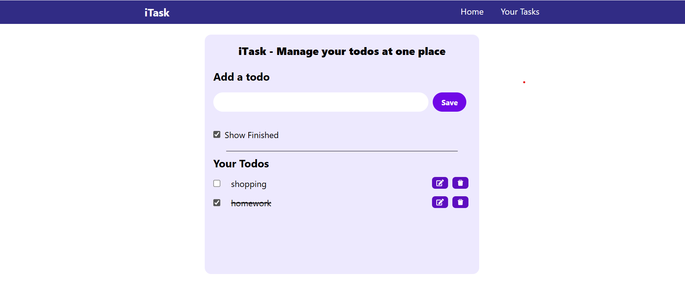

# iTask - Smart To-Do Planner ✅

iTask is a functional task management application built with **React** and **Vite**. It helps users organize their daily routine with a clean, responsive interface and persistent data storage.

## 🚀 Live Demo
[View the Live Project Here](https://astoriaking15.github.io/itask-todo-app/)

## ✨ Key Features
- **Data Persistence:** Uses `localStorage` to save your tasks so they stay even after a page refresh.
- **Full CRUD:** Create, Read, Update, and Delete tasks easily.
- **Responsive Design:** Optimized for both Desktop and Mobile devices.
- **Clean UI:** Built with modern CSS practices for a smooth user experience.

## 🛠️ Built With
- React.js
- Vite
- Tailwind CSS (or Vanilla CSS if you used that)
- LocalStorage API

## 📖 How to Run Locally
1. Clone the repo: `git clone https://github.com/astoriaking15/itask-todo-app.git`
2. Install dependencies: `npm install`
3. Start the dev server: `npm run dev`

## 🎓 Credits
This project was built as part of a learning journey following the tutorial by [CodeWithHarry](https://www.youtube.com/@CodeWithHarry). I implemented the logic and styling manually to strengthen my React and Node.js fundamentals.